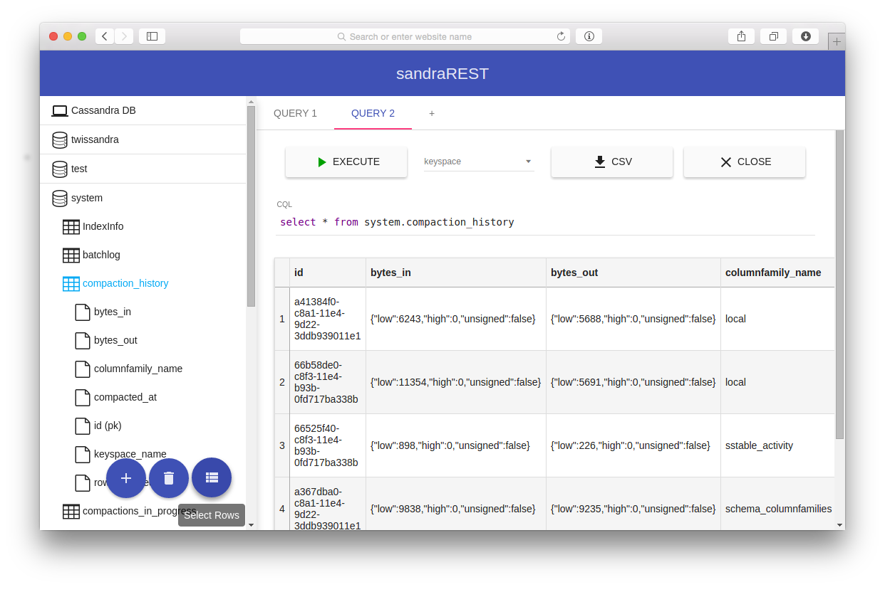
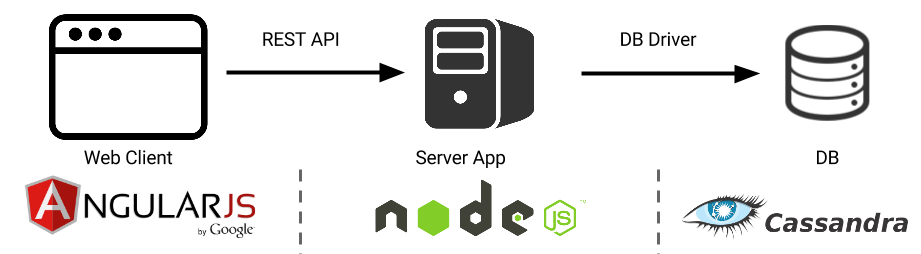

# sandraREST
Cassandra manager

[REST Endpoints](docs/rest_endpoints.md)
[Web UI User Guide](docs/user_guide.md)

### TODO

* Text query side
  * tab function for text query screen: allowing working on multiple queries like sql server manager using [this module]
  (https://material.angularjs.org/#/demo/material.components.tabs)
  * ~~[syntax highlighter](http://codemirror.net/mode/sql/index.html?mime=text/x-cassandra) for cql input~~
  (some improvement require)
* Database explorer
  * CRUD functions for keyspace, column family ...etc (rest and ui development) (in progress)
  * making host and port properties dynamic (rest and ui development) (in progress)
* Other
  * refactoring REST browser code (now everything was written in router)
  * unit test(?)

### Technologies
* [Cassandra](https://cassandra.apache.org/)
* [Node.js](http://nodejs.org/)
* [Express.js](http://expressjs.com/)
* [Angular.js](https://angularjs.org/)
* [Material Design](https://material.angularjs.org/)
* [CodeMirror](http://codemirror.net/)

##Tools
* [Bower](http://bower.io/)
* [Node Package Manager](https://www.npmjs.com/)
* [WebStorm](https://www.jetbrains.com/webstorm/)
* [Git](http://git-scm.com/)
* [Digital Ocean](https://www.digitalocean.com/)

### Similar Apps
* [Virgil](https://github.com/hmsonline/virgil/wiki)
* [ArrestDB](https://github.com/alixaxel/ArrestDB)

### REST endpoints
#### Query
* `PUT /query/ {query: String}` - run query
* `PUT /query/:keyspace/ {query: String}` - run query on given keyspace

#### Browser
`/connect/`

* `GET` - get the list of database servers
* `POST {address: String }` - add new database servers
* `PUT {address: [String] }` - set a new set of database servers
* `DELETE {address: [String] }` - remove set of servers from preferences

`/browser/`

* `GET` - get keyspaces

`/browser/:keyspace/`

* `GET` - get list of column families for given keyspace
* `POST {replication: {class: String, %class_properties%} }` - add new keyspace (`CREATE KEYSPACE`)
* `PUT {replication: {class: String, %class_properties%} }` - change properties of given keyspace (`ALTER KEYSPACE`)
* `DELETE` - drop given keyspace (`DROP KEYSPACE`)

`/browser/:keyspace/:column_family/`

* `GET` - get the whole column family for preview
* `POST {columns: [ {name: String, type: String} ], key: String, (options: [ {name: String, value: String|{}} ])? }` - add new column family (`CREATE TABLE`)
* `PUT {options: [ {name: String, value: String|{}} ]}` - change options of given column family (`ALTER TABLE WITH`)
* `DELETE` - drop given column family (`DROP TABLE`)

`/browser/:keyspace/:column_family/columns/`

* `GET` - get list of columns for given column family

`/browser/:keyspace/:column_family/columns/:column/`

* `GET` - get column properties
* `POST {type: String}` - add new column (`ALTER TABLE ADD`)
* `PUT {type: String}` - change properties of given column (`ALTER TABLE ALTER`)
* `DELETE` - delete given column (`ALTER TABLE DROP`)

`/browser/:keyspace/:column_family/rows/`

* `GET` - == `GET /browser/:keyspace/:column_family/`
