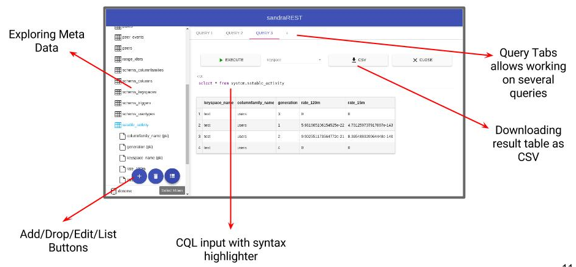

## Web UI User Guide

This application allows user to:
* Present database
* Run a CQL query
* Drop/Update/Create Keyspaces
* Drop Column Family
* Drop/Update/Create Column
* List data of Column Family
* Download result as CSV